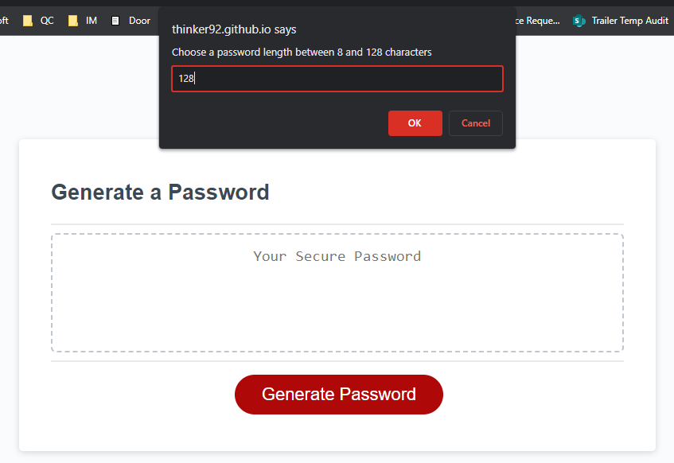

# JavaScript Password Generator

## Description
This application generates a secure password based on user-selected criteria. This enables users to create strong, secure passwords for a multitude of uses. 

## Features
* Generates a password between 8 and 128 characters in length
* User can chose to include:
  * Lowercase characters
  * Uppercase characters
  * Numeric characters
  * Special characters
* Validates user input and requires at least 1 type selection
  
## Usage
1. Click the 'Generate Password' button 
2. Follow the prompts to choose length and character types
3. After all prompts are answered, the generated password will be shown in the text area

## Screenshot of page

## Website
https://thinker92.github.io/Javascript-Password-Generator/
